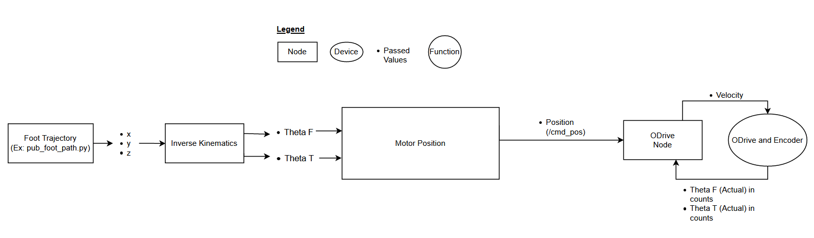
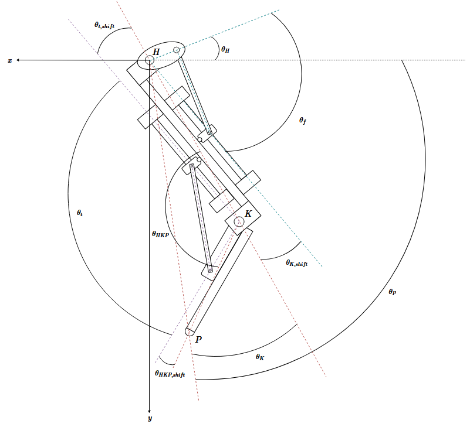

# opendog_ros
ROS driver for the [ODrive motor driver](https://odriverobotics.com/) based on Josh Marshall's [odrive_ros](https://github.com/neomanic/odrive_ros).
Modified for interfacing with and controlling the Lafayette OpenDog robot. 

This repository was developed over the summer of 2019 for the Lafayette OpenDog robot and was used to interface with ODrive motor controllers. We succeeded in implementing a simple walking gait (box pattern) on a single leg. The basic organization of the nodes is as follows:




The Lafayette OpenDog Senior Design Team continued this project over the 2019-2020 school year. To see the most up-to-date progress and documentation, check out the following repositories:
1. OpenDog: https://github.com/sanhalee17/Lafayette_OpenDog
2. OpenDog gazebo: https://github.com/sanhalee17/Lafayette_OpenDog_gazebo
3. OpenPup ROS package: https://github.com/fainorr/openpup_ros
4. Inverse kinematics sub-team: https://github.com/fainorr/opendog_IK
5. Gazebo hallway navigation simulations: https://github.com/fainorr/hallway_sim
6. Realistic leg model: https://github.com/whalenc/opendog_leg_description
7. Simple closed loop:https://github.com/whalenc/Fourbar

### Basic Operation
There are two options to run the code:
- To run code: ```rosrun odrive_ros odrive_node```
- To launch the launch file, get into /catkin_ws/src/odrive_ros/launch then input ```roslaunch odrive.launch``` or simply input ```roslaunch odrive_ros odrive.launch``` from anywhere
> - This has an option for automatically attempting to connect to the odrive
> - If using this option, make sure the terminal says that the ODrive actually connected before trying to execute services in another tab of the terminal

In a new terminal shell,
- To see all the possible commands, type ```rosservice list```
- To run a command, type ```rosservice call ____```

Typical procedure with rosrun (with roslaunch, the commands are ```/odrive/[service]```):
```
rosservice list
rosservice call /connect_driver
rosservice call /calibrate_motor
rosservice call /engage_motor
```

If you want to give a single command, for example, a velocity command:
```
rostopic pub -r 10 /cmd_vel geometry_msgs/Twist  '{linear:  {x: 100000, y: 100000, z: 100000}, angular: {x: 100000, y: 100000, z: 10000}}'
```

If you want to use wannabe sliders and see the “dashboard”:
- Open another terminal shell
- Type: ```rosrun rqt_gui rqt_gui```


### For Inverse Kinematics Testing

The diagram below maps out the geometry of the leg and significant angles for controlling the foot position.



Right now, I don’t have a launch file set up, so starting things up will be really annoying, but it is better for debugging (because it forces you to run each script individually and see what’s happening).  So it takes some patience…

To make sure everything is working:
- Test things out on odrivetool shell (see above)

Next step to test things:
- Make sure odrivetool shell is no longer running (type ```quit()``` to kill the program in that terminal)
- Input ```roscore``` in a separate terminal
- Input ```rosrun odrive_ros odrive_node.py``` in a separate terminal
- Input in a separate terminal: 
```
rosservice list
rosservice call /connect_driver
rosservice call /calibrate_motors
rosservice call /engage_motors
```
- Input in a separate terminal ```rosrun rqt_gui rqt_gui```
> - Will bring up window with sliders in lower right corner.  If they are missing, go to the box that says ```/cmd_pos```, click in it, and press Enter key
> - Be sure to adjust min and max values (they are in counts)
> - Once you are sure the motors are turning, close the rqt_gui dashboard

Now to work with IK:
- Leave roscore and rosrun odrive_ros odrive_node.py running
- In a separate terminal, input ```rosrun odrive_ros inverse_kinematics.py```
- In a separate terminal, input ```rosrun odrive_ros motor_position.py```
- In a separate terminal, you can now publish values by using:
```rostopic pub /footPosition geometry_msgs/Pose '{position: {x: 1, y: 1, z: 0}, orientation: {w: 0.0}}'```
